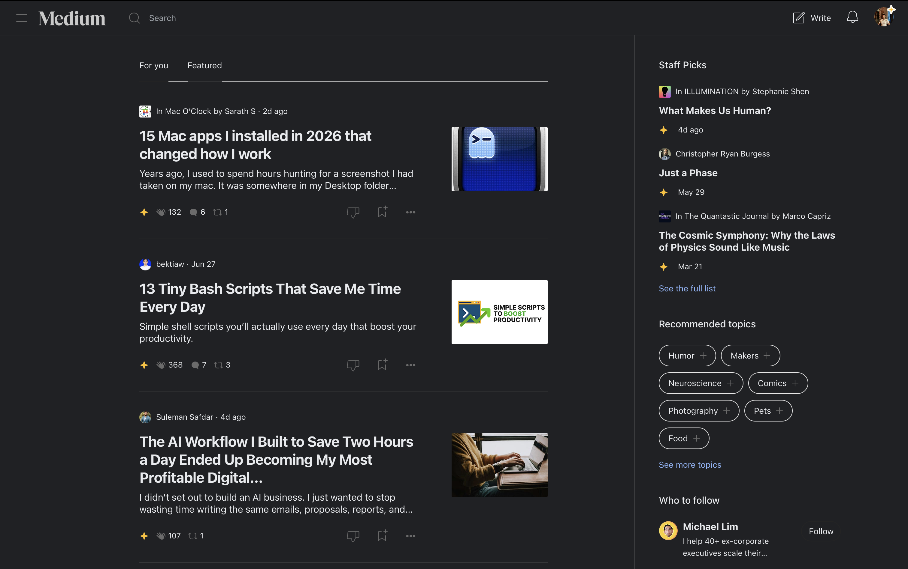
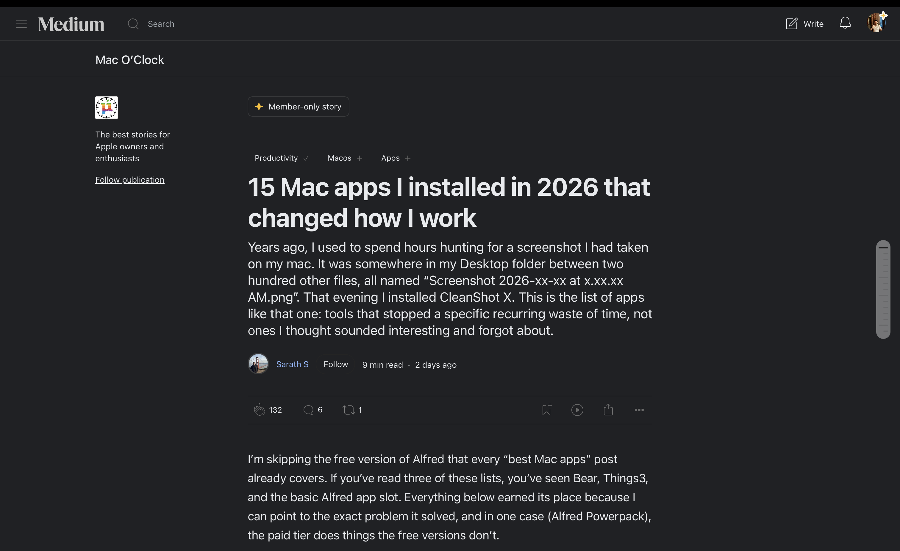

# Medium Dark Mode (Pake)

A dark theme, custom fonts, and branding fixes for [medium.com](https://medium.com),
packaged as a native desktop app using [Pake](https://github.com/tw93/pake).

Medium's web app has no built-in dark mode (only its mobile app does), and its
CSS-in-JS class names are hashed/regenerated on every deploy, so this theme is
implemented as a runtime script (`medium-dark.js`) plus a static stylesheet
(`medium-dark.css`) rather than targeting Medium's own class names.




## Pre-built download

A pre-built macOS `.dmg` is available on the [Releases page](../../releases)
instead of building it yourself.

**Note:** it's unsigned and not notarized, so macOS Gatekeeper will block it
on first launch. To open it: right-click the app → **Open**, or run
`xattr -cr Medium.app` in Terminal.

## What's included

- **Dark background** (`#202124`) applied only to elements that are actually
  white at runtime — not a blanket override, since Medium relies on
  transparent overlay `<div>`s (e.g. behind avatar images) that would
  otherwise get painted opaque.
- **Readable text/links** on the dark background.
- **Reader highlight annotations** (`<mark>`) and **hover/selected states**
  (e.g. topic pills) recolored to a consistent `#4c4d4c` accent.
- **Dimmed separators**: white divider borders lowered to a subtle `#3a3b3d`.
- **Icon fixes**: SVG icons (and CSS `mask-image`-based icons) with a
  hardcoded dark fill/stroke — including the Medium wordmark logo — are
  lightened instead of disappearing against the dark background.
- **Custom fonts**: `SF Pro Text`/`SF Pro Display` for body text, `JetBrains
  Mono` for code blocks.

## Prerequisites

- [Pake CLI](https://github.com/tw93/pake): `pnpm install -g pake-cli` (or `npm i -g pake-cli`)
- Node ≥22 (LTS recommended; ≥18 also works)
- Rust ≥1.85
- Platform build tools per [Tauri prerequisites](https://v2.tauri.app/start/prerequisites/)

### Fonts

This theme references fonts by name — Pake doesn't bundle fonts, so they must
already be installed on the machine doing the build:

| Font | Notes |
| --- | --- |
| `Helvetica` | Ships with macOS |
| `SF Pro Text` / `SF Pro Display` | Download from [Apple Fonts](https://developer.apple.com/fonts/) |
| `JetBrains Mono` | Download from [jetbrains.com/lp/mono](https://www.jetbrains.com/lp/mono/) |

If a font isn't installed, the browser falls back to the next in the
`font-family` list (ultimately system sans-serif/monospace) — it won't error,
just render differently. `SF Pro` and `JetBrains Mono` aren't available on
Windows/Linux unless installed there too.

## Building

Clone this repo, then from inside it run:

```bash
pake https://medium.com --name Medium --dark-mode \
  --inject ./medium-dark.css,./medium-dark.js \
  --hide-title-bar --debug
```

- `--dark-mode` sets the native window chrome to dark.
- `--inject` bakes the CSS/JS into the built binary at compile time — editing
  the files afterward has no effect on an already-built app; rebuild to pick
  up changes.
- `--hide-title-bar` removes the native title bar (macOS only).
- `--debug` enables DevTools inside the packaged app (useful for further
  tweaking); drop it for a smaller, optimized release build.

The output installer (`.dmg` on macOS, `.msi` on Windows, `.deb`/`.AppImage`
on Linux) will be placed in the current directory.

## Known limitations

- Styling fixes are heuristic-based (computed-style detection at runtime,
  e.g. "is this element's background currently white?") rather than targeting
  Medium's own class names, since those are regenerated on every Medium
  deploy. A future Medium redesign may require touch-ups.
- Not tested against every logged-in-only page/state.

## License

MIT — see [LICENSE](LICENSE).
